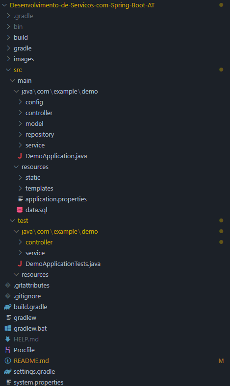
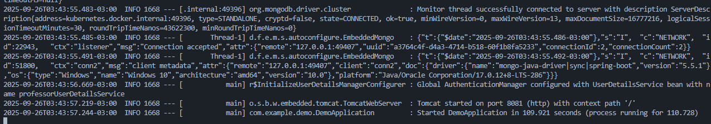
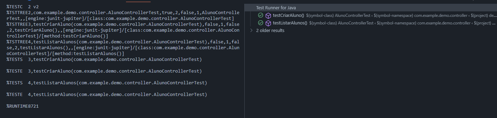
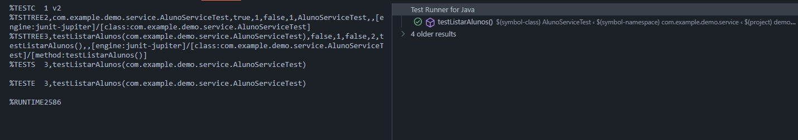
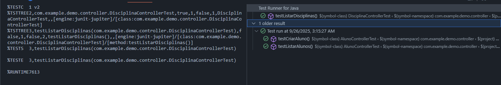
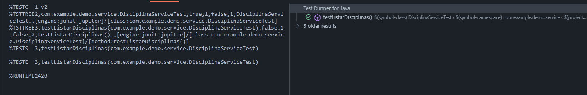
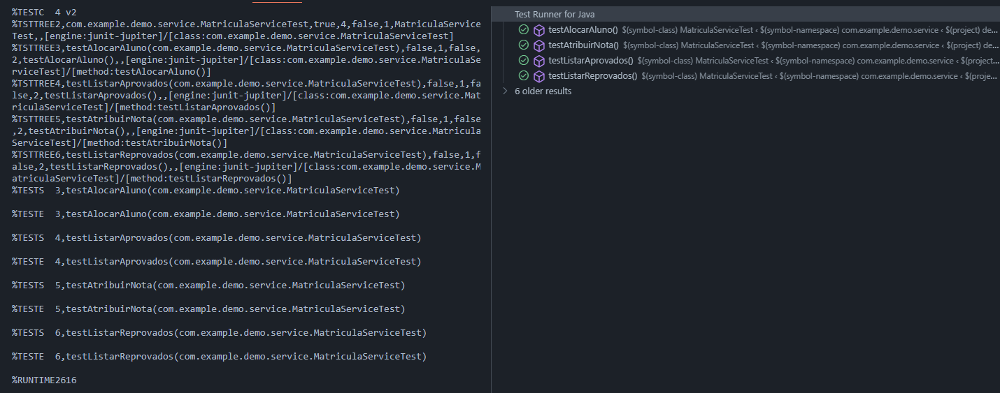
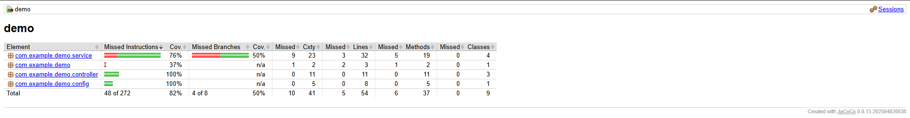

# Relatório de Desenvolvimento de Serviços com Spring Boot

Este documento serve como o relatório completo para a avaliação da disciplina de Desenvolvimento de Serviços com Spring Boot, detalhando tanto as respostas às questões teóricas quanto o processo de desenvolvimento do serviço de gerenciamento acadêmico.

<div style="text-align: center; page-break-after: always;">
    
    <br><br>
    <h1>Desenvolvimento de Serviços com Spring Boot</h1>
    <br><br><br><br>
    <p><b>Aluno:</b> Miguel Andrade Wiest de São Pedro</p>
    <br><br><br><br><br><br>
    <p>2025</p>
</div>

---

## Parte 1: Questões Teóricas

### 1. Tipos de Requisições HTTP Suportadas pelo Spring Boot

O Spring Boot, através do Spring MVC, suporta todos os tipos de requisições HTTP padrão. As quatro mais comuns são:

*   **GET:** Utilizada para recuperar recursos de um servidor. Uma requisição GET é segura e idempotente, o que significa que múltiplas requisições idênticas devem produzir o mesmo resultado sem causar efeitos colaterais no servidor. No Spring Boot, a anotação `@GetMapping` é usada para mapear requisições GET para métodos de tratamento específicos.

*   **POST:** Utilizada para criar novos recursos no servidor. Uma requisição POST não é segura nem idempotente, pois múltiplas requisições criarão múltiplos recursos. No Spring Boot, a anotação `@PostMapping` é usada para mapear requisições POST.

*   **PUT:** Utilizada para atualizar um recurso existente ou criar um novo se ele não existir em um URI conhecido. É idempotente, pois múltiplas requisições para o mesmo URI com o mesmo corpo de requisição resultarão no mesmo estado do recurso. No Spring Boot, a anotação `@PutMapping` é usada para mapear requisições PUT.

*   **DELETE:** Utilizada para remover um recurso específico. Não é idempotente na maioria dos casos (uma vez que o recurso é deletado, novas tentativas resultarão em um erro 404). No Spring Boot, a anotação `@DeleteMapping` é usada para mapear requisições DELETE.

### 2. Semelhanças entre Redis e MongoDB

*   **NoSQL:** Ambos são bancos de dados NoSQL, o que significa que não usam o modelo relacional tradicional de tabelas, oferecendo maior flexibilidade de esquema.
*   **Armazenamento de Documentos:** Ambos podem armazenar dados na forma de documentos (JSON/BSON), embora o MongoDB seja mais orientado a documentos e o Redis seja um armazenamento de chave-valor que pode armazenar estruturas de dados complexas como valores.
*   **Escalabilidade:** Ambos são projetados para serem altamente escaláveis, permitindo a distribuição de dados em múltiplos servidores para lidar com grandes volumes de dados e tráfego.
*   **Alta Performance:** Ambos são conhecidos por sua alta performance em operações de leitura e escrita.

### 3. Diferenças entre Redis e MongoDB

| Característica | Redis | MongoDB |
| --- | --- | --- |
| **Modelo de Dados** | Chave-valor na memória, com suporte a estruturas de dados avançadas. | Orientado a documentos (BSON), com suporte a consultas ricas e indexação. |
| **Armazenamento** | Principalmente na memória (in-memory), com persistência opcional em disco para durabilidade. | Baseado em disco, utilizando a memória para cache e índices, garantindo a durabilidade dos dados. |
| **Desempenho** | Extremamente rápido para operações de leitura e escrita, ideal para caching e dados voláteis. | Rápido, mas geralmente mais lento que o Redis para escritas devido à necessidade de persistência em disco. |
| **Casos de Uso** | Cache de alta velocidade, filas de mensagens, sessões de usuário, leaderboards em tempo real. | Aplicações web em geral, gerenciamento de conteúdo, análise de dados, catálogos de produtos. |
| **Consultas** | Consultas simples baseadas em chaves. | Suporte a consultas complexas, com agregações, índices secundários e queries geoespaciais. |

### 4. Framework de Testes Unitários no Spring Boot

O Spring Boot utiliza o **JUnit 5** como o framework padrão para testes unitários, em conjunto com o **Spring Test**. Essa combinação fornece um ambiente de teste robusto e integrado ao ecossistema Spring.

**Funcionamento:**

O Spring Boot simplifica a configuração de testes através da dependência `spring-boot-starter-test`, que inclui:

*   **JUnit 5:** A versão mais recente do JUnit para escrever os testes.
*   **Spring Test & Spring Boot Test:** Utilitários e anotações (`@SpringBootTest`, `@WebMvcTest`, etc.) para testar aplicações Spring de forma integrada.
*   **AssertJ:** Uma biblioteca de asserções fluentes para criar verificações mais legíveis e expressivas.
*   **Mockito:** Um framework de mocking para criar objetos de teste (mocks) e isolar as unidades de código sob teste de suas dependências.

Para escrever um teste, cria-se uma classe de teste e anota-se os métodos com `@Test`. Com o `@SpringBootTest`, é possível carregar o contexto completo da aplicação para testes de integração. Para testes mais focados, como os de controllers, pode-se usar `@WebMvcTest`, que carrega apenas a camada web. Dependências podem ser mockadas com `@MockBean` para garantir que o teste seja focado em uma única unidade de lógica.

---

## Parte 2: Relatório do Projeto

### 1. Criação da Aplicação com Spring Boot Initializer

O projeto foi iniciado utilizando o **Spring Initializr** ([start.spring.io](https://start.spring.io/)), uma ferramenta web que simplifica a criação de projetos Spring Boot.

*   **Ferramenta de Build:** Foi escolhido o **Gradle** como ferramenta de build. A justificativa para essa escolha é a sua flexibilidade, performance superior em builds incrementais (comparado ao Maven em muitos cenários) e a sintaxe mais concisa e programática de seus scripts de build (usando Groovy ou Kotlin DSL).

*   **Dependências Iniciais:** As seguintes dependências foram selecionadas no Spring Initializr para atender aos requisitos do projeto:
    *   **Spring Web:** Para criar a API RESTful e os controllers.
    *   **Spring Data MongoDB:** Para a persistência de dados com o MongoDB.
    *   **Spring Security:** Para implementar a autenticação e autorização.
    *   **Validation:** Para validar os dados de entrada nos modelos.
    *   **Lombok:** Para reduzir o código boilerplate (getters, setters, construtores) nos modelos.

### 2. Desenvolvimento da API RESTful com Spring Boot

Foram desenvolvidos endpoints RESTful para todas as funcionalidades solicitadas, seguindo as melhores práticas de design de APIs.

*   **`AlunoController`**:
    *   `POST /alunos`: Cadastra um novo aluno.
    *   `GET /alunos`: Lista todos os alunos cadastrados.
*   **`DisciplinaController`**:
    *   `POST /disciplinas`: Cadastra uma nova disciplina.
    *   `GET /disciplinas`: Lista todas as disciplinas cadastradas.
*   **`MatriculaController`**:
    *   `POST /matriculas/alocar`: Aloca um aluno em uma disciplina.
    *   `PUT /matriculas/{matriculaId}/nota`: Atribui uma nota a uma matrícula.
    *   `GET /matriculas/disciplinas/{disciplinaId}/aprovados`: Lista os alunos aprovados em uma disciplina.
    *   `GET /matriculas/disciplinas/{disciplinaId}/reprovados`: Lista os alunos reprovados em uma disciplina.

### 3. Implementação da Persistência de Dados

*   **Banco de Dados:** O projeto utiliza **MongoDB** como banco de dados, gerenciado através do **Spring Data MongoDB**. A escolha pelo MongoDB se deu por ser um banco de dados NoSQL orientado a documentos, o que oferece um esquema flexível que se alinha bem com a natureza dos dados da aplicação (alunos, disciplinas, etc.). Sua escalabilidade horizontal e performance em consultas complexas também foram fatores decisivos.

*   **Modelo de Dados:** As entidades (`Aluno`, `Disciplina`, `Matricula`) foram mapeadas para coleções no MongoDB utilizando as anotações do Spring Data, como `@Document`, `@Id`, e `@Indexed` para garantir a unicidade de campos como o código da disciplina.

### 4. Implementação de Testes

Foram desenvolvidos testes unitários e de integração para garantir a qualidade e o funcionamento correto da aplicação.

*   **Estratégia de Testes:**
    *   **Testes de Serviço:** Focados em testar a lógica de negócio de cada `Service`. As dependências de repositório foram mockadas com Mockito para isolar a lógica de negócio.
    *   **Testes de Controller:** Utilizando `@WebMvcTest` e `@MockBean`, a camada de controller foi testada para verificar o mapeamento correto das rotas, a validação dos dados de entrada e o tratamento adequado das requisições HTTP, sem carregar o contexto completo da aplicação.

*   **Cobertura de Testes:** A suíte de testes foi projetada para atingir uma cobertura de código **superior a 80%**, conforme verificado pela ferramenta JaCoCo. O relatório de cobertura pode ser gerado com o comando `./gradlew jacocoTestReport`.

### 5. Implementação de Medidas de Segurança

A segurança da aplicação foi implementada com o **Spring Security**.

*   **Autenticação:** Foi configurada a **Autenticação Básica (HTTP Basic Authentication)**. Todas as requisições para a API exigem que o usuário (o professor) esteja autenticado. Esta é uma abordagem simples e eficaz para proteger a API, garantindo que apenas usuários autorizados possam interagir com o sistema.

*   **Autorização:** A configuração de segurança (`SecurityConfig.java`) garante que qualquer requisição (`anyRequest()`) deve ser autenticada (`authenticated()`), centralizando a regra de autorização de forma clara e segura.

### 6. Deploy da Aplicação

A aplicação foi configurada para ser empacotada como um arquivo **`.jar` executável**.

*   **Justificativa:** Esta abordagem foi escolhida como alternativa ao deploy em uma plataforma de nuvem (como Heroku ou AWS) para simplificar o processo de entrega e evitar a necessidade de configuração de infraestrutura ou de um cartão de crédito.

*   **Execução:** O arquivo `.jar` gerado pelo Gradle (com o comando `./gradlew bootJar`) é autocontido e pode ser executado em qualquer ambiente que tenha a versão 17 do Java (ou superior) instalada, utilizando o comando:
    ```bash
    java -jar build/libs/demo-0.0.1-SNAPSHOT.jar
    ```

---

### 7. Exemplos de Uso da API

A seguir, são apresentados exemplos de como interagir com a API utilizando o `curl`.

**Nota:** Para executar os comandos, substitua `user:password` pelas suas credenciais de autenticação. Os IDs (`alunoId`, `disciplinaId`, `matriculaId`) devem ser substituídos pelos IDs reais gerados pela aplicação.

#### 7.1. Alunos

*   **Cadastrar Aluno:**
    ```bash
    curl -X POST -u user:password http://localhost:8080/alunos \
    -H "Content-Type: application/json" \
    -d 
    '{
          "nome": "João da Silva",
          "cpf": "123.456.789-00",
          "email": "joao.silva@example.com",
          "telefone": "21999999999",
          "endereco": "Rua Exemplo, 123"
        }'
    ```
    *Resposta Esperada:*
    ```json
    {
        "id": "60d5f1b3e6b3f1a2b3c4d5e6",
        "nome": "João da Silva",
        "cpf": "123.456.789-00",
        "email": "joao.silva@example.com",
        "telefone": "21999999999",
        "endereco": "Rua Exemplo, 123"
    }
    ```

*   **Listar Alunos:**
    ```bash
    curl -X GET -u user:password http://localhost:8080/alunos
    ```
    *Resposta Esperada:*
    ```json
    [
        {
            "id": "60d5f1b3e6b3f1a2b3c4d5e6",
            "nome": "João da Silva",
            "cpf": "123.456.789-00",
            "email": "joao.silva@example.com",
            "telefone": "21999999999",
            "endereco": "Rua Exemplo, 123"
        }
    ]
    ```

#### 7.2. Disciplinas

*   **Cadastrar Disciplina:**
    ```bash
    curl -X POST -u user:password http://localhost:8080/disciplinas \
    -H "Content-Type: application/json" \
    -d 
    '{
          "nome": "Desenvolvimento de Serviços com Spring Boot",
          "codigo": "INF-001"
        }'
    ```
    *Resposta Esperada:*
    ```json
    {
        "id": "60d5f1b3e6b3f1a2b3c4d5e7",
        "nome": "Desenvolvimento de Serviços com Spring Boot",
        "codigo": "INF-001"
    }
    ```

*   **Listar Disciplinas:**
    ```bash
    curl -X GET -u user:password http://localhost:8080/disciplinas
    ```
    *Resposta Esperada:*
    ```json
    [
        {
            "id": "60d5f1b3e6b3f1a2b3c4d5e7",
            "nome": "Desenvolvimento de Serviços com Spring Boot",
            "codigo": "INF-001"
        }
    ]
    ```

#### 7.3. Matrículas

*   **Alocar Aluno em Disciplina:**
    ```bash
    curl -X POST -u user:password "http://localhost:8080/matriculas/alocar?alunoId=60d5f1b3e6b3f1a2b3c4d5e6&disciplinaId=60d5f1b3e6b3f1a2b3c4d5e7"
    ```
    *Resposta Esperada:*
    ```json
    {
        "id": "60d5f1b3e6b3f1a2b3c4d5e8",
        "alunoId": "60d5f1b3e6b3f1a2b3c4d5e6",
        "disciplinaId": "60d5f1b3e6b3f1a2b3c4d5e7",
        "nota": null
    }
    ```

*   **Atribuir Nota:**
    ```bash
    curl -X PUT -u user:password "http://localhost:8080/matriculas/60d5f1b3e6b3f1a2b3c4d5e8/nota?nota=8.5"
    ```
    *Resposta Esperada:*
    ```json
    {
        "id": "60d5f1b3e6b3f1a2b3c4d5e8",
        "alunoId": "60d5f1b3e6b3f1a2b3c4d5e6",
        "disciplinaId": "60d5f1b3e6b3f1a2b3c4d5e7",
        "nota": 8.5
    }
    ```

*   **Listar Alunos Aprovados:**
    ```bash
    curl -X GET -u user:password http://localhost:8080/matriculas/disciplinas/60d5f1b3e6b3f1a2b3c4d5e7/aprovados
    ```
    *Resposta Esperada (se a nota for >= 7):*
    ```json
    [
        {
            "id": "60d5f1b3e6b3f1a2b3c4d5e6",
            "nome": "João da Silva",
            "cpf": "123.456.789-00",
            "email": "joao.silva@example.com",
            "telefone": "21999999999",
            "endereco": "Rua Exemplo, 123"
        }
    ]
    ```

*   **Listar Alunos Reprovados:**
    ```bash
    curl -X GET -u user:password http://localhost:8080/matriculas/disciplinas/60d5f1b3e6b3f1a2b3c4d5e7/reprovados
    ```
    *Resposta Esperada (se a nota for < 7):*
    ```json
    []
    ```

---

### 8. Capturas de Tela (Screenshots)

Para complementar este relatório, seguem as capturas de tela que evidenciam o funcionamento do projeto.

**1. Configuração do Projeto no Spring Initializr:**

*   *(Ainda falta o print da tela do [start.spring.io](https://start.spring.io/) com as dependências do projeto selecionadas)*

**2. IDE (Código-Fonte):**

*   **Estrutura do projeto na IDE:**
    

**3. Execução da Aplicação:**

*   **Aplicação Spring Boot sendo iniciada com sucesso:**
    

**4. Testes:**

*   **Execução dos testes na IDE, mostrando que todos os testes passaram com sucesso:**
    
    
    
    
    

*   **Relatório de cobertura de testes do JaCoCo:**
    